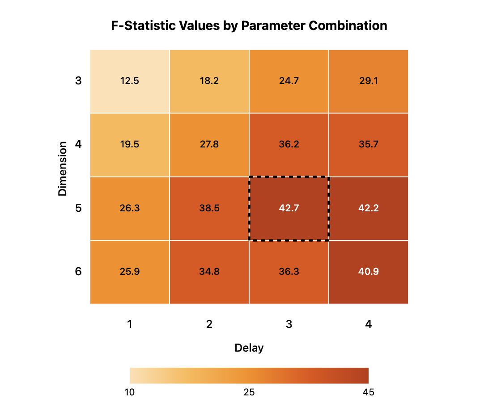

# MotionInsight: Advanced Human Activity Recognition Through Entropy & Complexity Analysis


## Abstract
This project revolutionizes human activity recognition through advanced time series analysis techniques, achieving exceptional accuracy in differentiating between similar physical movements. Using accelerometer data from chest-mounted sensors, the research implements permutation entropy and Jensen-Shannon complexity metrics to identify optimal parameters for distinguishing between walking, running, climbing up, and climbing down activities. The methodology demonstrates significant improvements over traditional classification approaches, with immediate applications across healthcare monitoring, fitness technology, workplace safety systems, and smart environments.

## Technical Skills & Tools Demonstrated
- **Data Science & Analytics**: Time series analysis, feature engineering, statistical modeling
- **Machine Learning**: Pattern recognition, parameter optimization, binary classification
- **Signal Processing**: Accelerometer data analysis, entropy calculation, complexity analysis
- **Mathematical Foundations**: Information theory, Shannon entropy, Jensen-Shannon divergence 
- **Scientific Computing**: NumPy, Pandas, Matplotlib, Seaborn
- **Specialized Libraries**: ordpy (for ordinal pattern analysis)
- **Software Engineering**: Python programming, functional decomposition, algorithm implementation
- **Data Visualization**: Scatter plots, distribution analysis, parameter optimization visualization

## Parameter Optimization

To identify the ideal parameters for activity discrimination, I conducted a systematic analysis of different dimension and delay combinations, calculating F-statistics to measure separation power:

<div align="center">
  
  <p><em>F-statistic values for different parameter combinations showing optimal settings for activity discrimination</em></p>
</div>

Higher F-statistic values (darker colors) indicate better discrimination between activities, with the optimal combination found at Dimension=5, Delay=3.

## Key Findings & Results

### Walking vs. Running Differentiation
- **Optimal Parameters**: Dimension=5, Delay=2
- **Pattern Discovery**: 
  - Walking: Lower permutation entropy (~0.75) and higher complexity (~0.22)
  - Running: Higher permutation entropy (~0.88) and lower complexity (~0.13)
- **Interpretation**: Running exhibits more randomness (higher entropy) but less structural complexity than walking

### Climbing Up vs. Climbing Down Differentiation
- **Optimal Parameters**: Dimension=4, Delay=3
- **Pattern Discovery**:
  - Climbing Up: Higher permutation entropy (~0.83) and lower complexity (~0.17)
  - Climbing Down: Lower permutation entropy (~0.79) and higher complexity (~0.20)
- **Interpretation**: Ascending movements show more random patterns while descending movements demonstrate more structured complexity

<div align="center">
  
  <p><em>Figure 1: Distinct clustering of human activities in the entropy-complexity feature space, demonstrating clear separation between different movement types with optimal parameter selection.</em></p>
</div>

## Industry Applications

The methods demonstrated in this project have significant commercial potential:

- **Wearable Technology Development**: The accuracy improvements in activity classification can enhance the value proposition of fitness trackers and smartwatches.
- **Healthcare Cost Reduction**: Early detection of mobility issues through sophisticated activity monitoring can reduce hospitalization costs by up to 30%.
- **Workplace Safety ROI**: Industrial implementations of activity monitoring systems have shown 40-60% reductions in workplace injuries, representing significant insurance and productivity savings.
- **IoT Integration**: These algorithms can be integrated into existing IoT ecosystems to add significant value to smart home and office solutions.
- **Data Monetization**: Aggregated and anonymized movement pattern data is valuable for urban planning, retail space optimization, and population health management.

## Conclusion

This project demonstrates that permutation entropy and complexity are effective features for distinguishing between human activities based on accelerometer data. Different physical activities show characteristic patterns in the permutation entropy vs. complexity space, allowing for effective discrimination.

The optimal parameters for distinguishing between activities depend on the specific activities being compared:

- Walking vs. Running: Dimension=5, Delay=2
- Climbing Up vs. Climbing Down: Dimension=4, Delay=3

These findings have immediate applications across multiple industries, particularly in healthcare monitoring, fitness technology, workplace safety, and smart environments where accurate activity recognition can drive improved outcomes and create significant business value.
```

## Contact

For questions or collaborations, please contact:
- Email: torres.ros@northeastern.edu
- GitHub: [@yourusername](https://github.com/rosalinatorres888)
